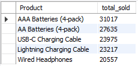

# Sales_Perfomance_Analysis_Project
Sales perfomance project based on item transaction dataset, data cleaning using Python, data analysis using SQL, and data visualization using Tableu Public. This project was inpsired by [Github Project](https://github.com/KeithGalli/Pandas-Data-Science-Tasks).

## Dashboard Preview
Here is the final dashboard preview, you can find the full dashboard [here](https://public.tableau.com/views/SalesPerfomanceAnalysis_16364520828390/SalesPerfomanceAnalysis?:language=en-US&:display_count=n&:origin=viz_share_link).


## Data and Tools
**Dataset** - Transaction data with over 180000 rows and 6 columns. 

**Data Cleaning** - Python using Jupyter Notebook

**Data Analysis** - MySQL using MySQL Workbench

**Data Visualization** - Tableu Public

## Questions for Data Analysis
1. What was the best month for sales? How much was earned that month?
2. What city sold the most product?
3. What time should we display advertisemens to maximize the likelihood of customer’s buying product?
4. What product sold the most? Why do you think it sold the most?

## Data Cleaning and Analysis
### Data Overview
Data consist of 186850 of item transaction-related variables such as Order ID, Product, Quantity Ordered, Price Each, Order Date, and Purchase Address.


### Data Cleaning using Python
***Findings and Solution***
- There are 545 rows with null values on each of its columns, so the rows can all be dropped.
- There are 355 rows that contains columns name and not the real values, so i also drop all the rows.
- To assist our data analysis, i will add several columns specifically 'total purchase' column, 'month' column, and 'city' column.
  


***Adding total purchase column***

Total purchase column obtained by multiplying value from 'quantity ordered' column with 'price each' column.
```python
uncleaned['Total Purchase'] = uncleaned['Quantity Ordered'] * uncleaned['Price Each']
```

***Adding total month column***

Month purchase column obtained by extracting the month number from 'order date' column and converting it to its name.
```python
uncleaned['Month'] = uncleaned['Order Date'].dt.month

month_dict = {
    1 : "January",
    2 : "February",
    3 : "March",
    4 : "April",
    5 : "May",
    6 : "June",
    7 : "July",
    8 : "August",
    9 : "September",
    10 : "October",
    11 : "November",
    12 : "December"
}
uncleaned = uncleaned.replace({"Month":month_dict})
```

***Adding total city column***

City column obtained by extracting city name from 'purchase address' column.
```python
def get_city(df):
    df = df.split(',')
    return df[1].strip()

uncleaned['City'] = uncleaned['Purchase Address'].apply(lambda x : get_city(x))
```


### Data Analysis using SQL
***What was the best month for sales? How much was earned that month?***
```SQL
SELECT sales_data.Month, COUNT(*) as total_sales, FORMAT(SUM(`Total Purchase`), 'C') as total_earnings
FROM sales_data
GROUP BY sales_data.Month
ORDER BY total_earnings DESC;
```


***What city sold the most product?***
```SQL
SELECT City, SUM(`Quantity Ordered`) as total_sales
FROM sales_data
GROUP BY City
ORDER BY total_sales DESC;
```


***What time should we display advertisemens to maximize the likelihood of customer’s buying product?***
```SQL
SELECT HOUR(`Order Date`) as hour, SUM(`Quantity Ordered`) as total_sales
FROM sales_data
GROUP BY hour
ORDER BY total_sales DESC
LIMIT 5;
```


***What product sold the most?***
```SQL
SELECT Product, SUM(`Quantity Ordered`) as total_sold
FROM sales_data
GROUP BY Product
ORDER BY total_sold desc
LIMIT 5;
```

